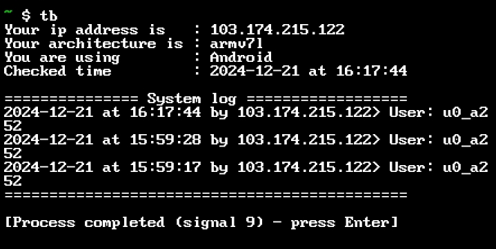

# Terminate-bash-Terminal
### How to use this simple tool ?
##### Update your termux
`pkg update && pkg upgrade -y` or `pkg up -y`
##### Install git
`apt install git -y`
##### Clone this repository 
`git clone https://github.com/Alomgir-Bhuiyan/Terminate-bash-Terminal.git`
##### Start setting up 
`cd Terminate-bash-Terminal`  
`chmod +x *` 
`bash setup.sh` 
And here you go. Use `tb` to run the program
### Screenshot

